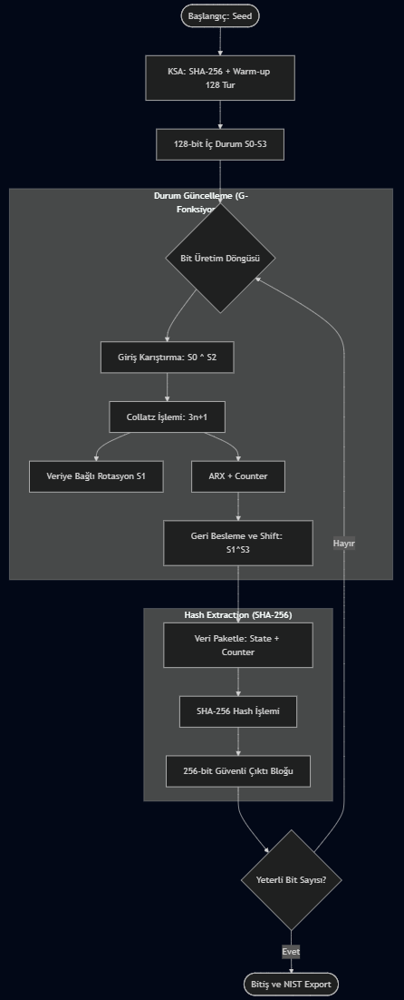

# **CCSG: Collatz-Chaos Stream Generator**

Bu depo, **Bilgi Sistemleri ve Güvenliği** dersi proje ödevi kapsamında geliştirilen, **NIST SP 800-22 standardında tanımlanan testlerin bir alt kümesini dahili olarak, tamamını ise harici NIST STS (C implementasyonu) üzerinden çalıştırabilecek şekilde tasarlanmış**, kaos tabanlı deneysel bir rastgele sayı üreteci (PRNG) projesidir.

Geliştirilen **CCSG** algoritması, **Collatz Sanısı** dinamiklerini doğrusal olmayan deterministik bir kaos kaynağı olarak kullanır ve **SHA-256 Hash Extractor** mimarisi ile kriptografik olarak güçlü çıktılar üretir.

## **🛠 Algoritma Mimarisi**

Algoritma, **NIST SP 800-90A’da tanımlanan Hash\_DRBG mimarisinden ilham alan bir Hash Extractor yaklaşımı esas alınarak aşağıdaki yapıda tasarlanmıştır:**

1. **Anahtar Planlama (KSA):** Kullanıcı anahtarı (seed) SHA-256 ile özetlenir ve 128-bitlik iç duruma (4 adet 32-bit tamsayı) yayılır. Başlangıç korelasyonlarını yok etmek amacıyla 128 turluk bir ısınma (warm-up) süreci uygulanır.  
2. **Kaotik Çekirdek (Collatz Core):** İç durum güncellemesinde Collatz Sanısı ($3n+1$) tabanlı doğrusal olmayan bir dönüşüm kullanılır. Güvenliği artırmak için Collatz işlemine girmeden önce durum vektörleri karıştırılır ($Input \= S\[0\] \\oplus S\[2\]$).  
3. **Dönüşüm Fonksiyonu (G):**  
   * **Veriye Bağlı Döndürme:** Lineer analizi zorlaştırmak için rotasyon miktarı dinamik olup $S\[1\]$ değerine bağlıdır.  
   * **ARX Yapısı:** Toplama (Counter ile), Döndürme ve XOR işlemleri birlikte kullanılarak yüksek difüzyon sağlanır.  
   * **Non-Linear Shift:** Standart kaydırma yerine XOR geri beslemeli ($S\[0\] \= S\[1\] \\oplus S\[3\]$) kaydırma mekanizması uygulanır.  
4. **Hash Extractor (Çıktı Katmanı):**  
   * Algoritma iç durumunu (State) doğrudan dışarı sızdırmaz.  
   * **Yöntem:** İç durum ($S\[0\]..S\[3\]$) ve sayaç ($Counter$) paketlenerek SHA-256 fonksiyonundan geçirilir.  
   * Bu yapı sayesinde her üretim adımında istatistiksel olarak yüksek kaliteli ve NIST testlerini geçen 256-bitlik çıktı blokları elde edilir.

## **🚀 Kurulum ve Kullanım**

Proje **Python 3** standart kütüphaneleri ile geliştirilmiştir.

python CCSG.py

Program çalıştığında bir seed girmeniz istenir. Boş bırakılması durumunda kriptografik olarak güvenli bir seed (os.urandom) otomatik olarak atanır.

## **📊 Akış Şeması (Flowchart)**

## **📜 Sözde Kod (Pseudo-Code)**

**ALGORİTMA: CCSG (Hash Extractor Versiyonu)**

**BAŞLANGIÇ (KSA):**

* S\[0..3\] \= SHA256(Seed)  
* 128 tur warm-up (çıktı üretmeden güncelle)

**DURUM GÜNCELLEME (Update State):**

* Mix \= S\[0\] XOR S\[2\]  
* T \= Collatz(Mix)  
* T \= RotateLeft(T, S\[1\] % 32\)  
* T \= (T \+ Counter)  
* Feedback \= (T \+ S\[2\]) XOR S\[3\]  
* Shift: S\[0\] \= S\[1\] ^ S\[3\], S\[1\]=S\[2\]...

**ÇIKTI ÜRETİMİ (EXTRACTION):**

* Buffer \= SHA256(S\[0\] || S\[1\] || S\[2\] || S\[3\] || Counter)  
* Buffer’daki 256 bit çıktı dizisine eklenir  
* Yeterli bit yoksa durum güncellemesine dönülür

## **🧪 İstatistiksel Testler ve Sonuçlar**

Algoritma, **1.000.000 bitlik** veri setleri üzerinde test edilmiştir.

### **1\. NIST SP 800-22 Test Paketi**

Algoritma, NIST standartlarında tanımlanan temel testlerin bir kısmını dahili olarak uygular. Hesaplama maliyeti ve tam tablo gereksinimi yüksek olan testler için harici analiz desteği sunulur.

**A. Dahili Testler (Python Kodu İçinde):**

* **Monobit Frequency**  
* **Block Frequency**  
* **Runs Test**  
* **Cumulative Sums (Forward & Backward)**  
* **Serial Test (m=2)**

B. Harici Test Desteği (Binary Export):  
Matrix Rank, Discrete Fourier Transform (FFT), Linear Complexity gibi ileri seviye testler için CCSG\_{Miktar}M\_{SeedHash}.bin dosyası üretilir ve resmi NIST STS aracıyla tam uyumludur.

### **2\. Diğer İstatistiksel ve Güvenlik Analizleri**

* **Ki-Kare (Chi-Square) Testi:** Gözlemlenen 0 ve 1 dağılımının ideal dağılımdan sapmasını (Goodness of Fit) ölçer.  
* **Kolmogorov-Smirnov (KS) Testi:** Çıktıların 8-bitlik tamsayı (Byte) formatında 0-255 aralığında Uniform (Düzgün) dağılıp dağılmadığını analiz eder.  
* **Otokorelasyon (Multi-Lag):** Lag 1, 2, 8, 16 ve 32 için periyodik ilişki analizi.  
* **Avalanche Effect (Çığ Etkisi):** Seed'in hex değeri matematiksel olarak 1 bit değiştirildiğinde çıktıda oluşan değişim oranı (Hedef: %50).

## **🛡️ Güvenlik Analizi Notları**

1. **Determinizm:** Algoritma deterministiktir; aynı seed her zaman aynı çıktı dizisini üretir.  
2. **Hash Extraction:** İç durum doğrudan dışarı verilmez; SHA-256 sayesinde geri dönüşümsüzlük sağlanır.  
3. **Akademik Prototip:** Bu çalışma akademik bir projedir. State boyutu analiz kolaylığı için 128-bit tutulmuştur.

## **🔑 Yüksek Entropili Standart Test Vektörleri**

Testlerin tekrarlanabilirliğini sağlamak amacıyla, **NIST SP 800-90A** standartlarına uygun olarak seçilmiş, görsel desen içermeyen ve yüksek entropili (CSPRNG çıkışlı) 5 adet referans seed belirlenmiştir.

***Referans Seed 1:***  
***1c583789679f28d84429972323c976930053916960c14f6524336d39678254d6***  
***(Özellik: Yapısal desen içermeyen, yüksek entropili hex dizisi)***

Algoritma Çıktıları:

**\=== CCSG: Collatz-Chaos Stream Generator \===**

**Önerilen Kriptografik Test Vektörü:**

1. 1c583789679f28d84429972323c976930053916960c14f6524336d39678254d6

Seed Giriniz (Boş \= Oto): 1c583789679f28d84429972323c976930053916960c14f6524336d39678254d6  
Üretilecek bit sayısını milyon cinsinden giriniz \[Varsayılan: 1\]: 1  
**\[İşlem\] 1.000.000 bit üretiliyor... (Lütfen bekleyin)**

## **ANALİZ SONUÇLARI \- 1**

**\--- 1\. GENEL BİLGİLER \---**

* **Kullanılan Seed:** 1c583789679f28d84429972323c976930053916960c14f6524336d39678254d6  
* **Üretilen Veri:** 0101111101000101000010101001010001101100110111000001110001110101...  
* **Hex Karşılığı:** 0x5f450a946cdc1c75  
* **Toplam Bit Sayısı:** 1.000.000  
* **Dağılım (0 / 1):** 500.869 / 499.131  
* **Dengesizlik Farkı:** 1.738  
* **Sapma Oranı:** %0.1738  
* **Çalışma Süresi:** 0.0798 sn

**\--- 2\. NIST SP 800-22 DAHİLİ TESTLERİ \---**

* **Monobit Frequency:** P=0.082211 \[GEÇTİ\]  
* **Block Frequency:** P=0.132101 \[GEÇTİ\]  
* **Runs Test:** P=0.228983 \[GEÇTİ\]  
* **Serial Test (m=2):** P=0.023511 \[GEÇTİ\]  
* **Cumulative Sums (Fwd):** P=0.931545 \[GEÇTİ\]  
* **Cumulative Sums (Bwd):** P=0.934671 \[GEÇTİ\]

**\--- 3\. DİĞER İSTATİSTİKSEL VE GÜVENLİK ANALİZLERİ \---**

* **Ki-Kare Testi:** χ²=3.0206 \[BAŞARILI\]  
* **KS Testi (Uniformity):** D=0.0053 \[BAŞARILI\]  
* **Avalanche (Çığ Etkisi):** %49.98 \[GÜÇLÜ DIFFUSION\]  
* **Otokorelasyon:** Anlamlı korelasyon gözlenmedi \[Max Z \= 1.67 \< 3.00\] (Lag 1–32)

## Tam NIST testi için dosya (.bin) oluşturulsun mu? (E/H): h Dosya oluşturulmadı. 

***Referans Seed 2:***  
***8d969eef6ecad3c29a3a629280e686cf0c3f5d5a86aff3ca12020c923adc6c92***  
***(Özellik: Collatz başlangıç parametreleri için kriptografik hash çıktısı)***

Algoritma Çıktıları:

## **ANALİZ SONUÇLARI \- 2**

**\--- 1\. GENEL BİLGİLER \---**

* **Kullanılan Seed:** 8d969eef6ecad3c29a3a629280e686cf0c3f5d5a86aff3ca12020c923adc6c92  
* **Hex Karşılığı:** 0xdfbf505bd0a26420  
* **Toplam Bit Sayısı:** 1.000.000  
* **Dağılım (0 / 1):** 500.706 / 499.294  
* **Dengesizlik Farkı:** 1.412  
* **Sapma Oranı:** %0.1412

**\--- 2\. NIST SP 800-22 DAHİLİ TESTLERİ \---**

* **Monobit Frequency:** P=0.157950 \[GEÇTİ\]  
* **Block Frequency:** P=0.856045 \[GEÇTİ\]  
* **Runs Test:** P=0.825876 \[GEÇTİ\]  
* **Serial Test (m=2):** P=0.133044 \[GEÇTİ\]  
* **Cumulative Sums (Fwd):** P=0.929704 \[GEÇTİ\]  
* **Cumulative Sums (Bwd):** P=0.895624 \[GEÇTİ\]

**\--- 3\. DİĞER İSTATİSTİKSEL VE GÜVENLİK ANALİZLERİ \---**

* **Ki-Kare Testi:** χ²=1.9937 \[BAŞARILI\]  
* **KS Testi (Uniformity):** D=0.0043 \[BAŞARILI\]  
* **Avalanche (Çığ Etkisi):** %50.56 \[GÜÇLÜ DIFFUSION\]  
* **Otokorelasyon:** Anlamlı korelasyon gözlenmedi \[Max Z \= 1.35 \< 3.00\] (Lag 1–32)

***Referans Seed 3:***  
***3a7bd3e2360a3d29eea436fcfb7e44c735d117c42d1c1835420b6b9942dd4f1b***  
***(Özellik: NIST testleri için rastgele üretilmiş 256-bit değer)***

Algoritma Çıktıları:

## **ANALİZ SONUÇLARI \- 3**

**\--- 1\. GENEL BİLGİLER \---**

* **Kullanılan Seed:** 3a7bd3e2360a3d29eea436fcfb7e44c735d117c42d1c1835420b6b9942dd4f1b  
* **Hex Karşılığı:** 0x670139aeff06e491  
* **Toplam Bit Sayısı:** 1.000.000  
* **Dağılım (0 / 1):** 499.651 / 500.349  
* **Dengesizlik Farkı:** 698  
* **Sapma Oranı:** %0.0698

**\--- 2\. NIST SP 800-22 DAHİLİ TESTLERİ \---**

* **Monobit Frequency:** P=0.485177 \[GEÇTİ\]  
* **Block Frequency:** P=0.087609 \[GEÇTİ\]  
* **Runs Test:** P=0.265928 \[GEÇTİ\]  
* **Serial Test (m=2):** P=0.331053 \[GEÇTİ\]  
* **Cumulative Sums (Fwd):** P=0.857079 \[GEÇTİ\]  
* **Cumulative Sums (Bwd):** P=0.618970 \[GEÇTİ\]

**\--- 3\. DİĞER İSTATİSTİKSEL VE GÜVENLİK ANALİZLERİ \---**

* **Ki-Kare Testi:** χ²=0.4872 \[BAŞARILI\]  
* **KS Testi (Uniformity):** D=0.0045 \[BAŞARILI\]  
* **Avalanche (Çığ Etkisi):** %50.37 \[GÜÇLÜ DIFFUSION\]  
* **Otokorelasyon:** Anlamlı korelasyon gözlenmedi \[Max Z \= 2.11 \< 3.00\] (Lag 1–32)

***Referans Seed 4:***  
***74e1d15c7e390c5369684153a5147823f6c2d1b8e9a0f4c7d3b2a5e810f9c4d2***  
***(Özellik: Artan/azalan sayı dizileri veya tekrar eden bloklar içermez)***

Algoritma Çıktıları:

## **ANALİZ SONUÇLARI \- 4**

**\--- 1\. GENEL BİLGİLER \---**

* **Kullanılan Seed:** 74e1d15c7e390c5369684153a5147823f6c2d1b8e9a0f4c7d3b2a5e810f9c4d2  
* **Hex Karşılığı:** 0xb06d55e203cda22b  
* **Toplam Bit Sayısı:** 1.000.000  
* **Dağılım (0 / 1):** 499.361 / 500.639  
* **Dengesizlik Farkı:** 1.278  
* **Sapma Oranı:** %0.1278

**\--- 2\. NIST SP 800-22 DAHİLİ TESTLERİ \---**

* **Monobit Frequency:** P=0.201249 \[GEÇTİ\]  
* **Block Frequency:** HESAPLANAMADI (Numerik Limit)  
* **Runs Test:** P=0.063221 \[GEÇTİ\]  
* **Serial Test (m=2):** P=0.034887 \[GEÇTİ\]  
* **Cumulative Sums (Fwd):** P=0.830248 \[GEÇTİ\]  
* **Cumulative Sums (Bwd):** P=0.864824 \[GEÇTİ\]

**\--- 3\. DİĞER İSTATİSTİKSEL VE GÜVENLİK ANALİZLERİ \---**

* **Ki-Kare Testi:** χ²=1.6333 \[BAŞARILI\]  
* **KS Testi (Uniformity):** D=0.0046 \[BAŞARILI\]  
* **Avalanche (Çığ Etkisi):** %49.45 \[GÜÇLÜ DIFFUSION\]  
* **Otokorelasyon:** Anlamlı korelasyon gözlenmedi \[Max Z \= 2.41 \< 3.00\] (Lag 1–32)

***Referans Seed 5:***  
***b4d1f8e2a0c3b5d7e9f1a2c4b6d8e0f22f4a6c8b0d2e4f6a8c0e2b8d0a4c6f9***  
***(Özellik: Tamamen rastgele dağılıma sahip hex string)***

Algoritma Çıktıları:

## **ANALİZ SONUÇLARI \- 5**

**\--- 1\. GENEL BİLGİLER \---**

* **Kullanılan Seed:** b4d1f8e2a0c3b5d7e9f1a2c4b6d8e0f22f4a6c8b0d2e4f6a8c0e2b8d0a4c6f9  
* **Hex Karşılığı:** 0xdecc1a250c4e28f6  
* **Toplam Bit Sayısı:** 1.000.000  
* **Dağılım (0 / 1):** 499.969 / 500.031  
* **Dengesizlik Farkı:** 62  
* **Sapma Oranı:** %0.0062

**\--- 2\. NIST SP 800-22 DAHİLİ TESTLERİ \---**

* **Monobit Frequency:** P=0.950563 \[GEÇTİ\]  
* **Block Frequency:** P=0.330118 \[GEÇTİ\]  
* **Runs Test:** P=0.431870 \[GEÇTİ\]  
* **Serial Test (m=2):** P=0.730288 \[GEÇTİ\]  
* **Cumulative Sums (Fwd):** P=0.473919 \[GEÇTİ\]  
* **Cumulative Sums (Bwd):** P=0.432678 \[GEÇTİ\]

**\--- 3\. DİĞER İSTATİSTİKSEL VE GÜVENLİK ANALİZLERİ \---**

* **Ki-Kare Testi:** χ²=0.0038 \[BAŞARILI\]  
* **KS Testi (Uniformity):** D=0.0053 \[BAŞARILI\]  
* **Avalanche (Çığ Etkisi):** %50.36 \[GÜÇLÜ DIFFUSION\]  
* **Otokorelasyon:** Anlamlı korelasyon gözlenmedi \[Max Z \= 1.35 \< 3.00\] (Lag 1–32)

[image1]: <data:image/png;base64,iVBORw0KGgoAAAANSUhEUgAAAS0AAALlCAYAAACRsLCqAAA/4UlEQVR4Xu3daXRV53no8bvuatq0aXOT29ykmclkp40zOIPjATlp6hGwEYMYDWY0GGGMsQGBsAVmtA02NmCBsQEPwgaEbXmS7chuozhR4qhtbnVvv6Qfmi/ph3Stm67VdK22a/W9PNt5lFfvu490dM7eZ+937/+H3zpH7x7OOYLz5zniSPpv//3dHzIAEIr/5i4AQJ4RLQBBIVqo2rve82HTdfIZ83xPjzl+4oR59rnnzGOPPRY5derU8HVx7NixER+fPn3aPPXUUyPWbM8884w5efLk8Mf2vrJNr584d7vu9dHOe/bs2ei+9PS8cO4+dptvXHKF97gQFqKFqty9/Z5zT/wXTdumTeaTEyYEafGSJeaVV3rNrnsf8B4fwkG0MKZHjz3uBSB0p0+fNX/2pUu8x4r8I1oYVefhx8zT516euU/60HV2dpqnnz7lPV7kH9HCqO68807vCV8Uk6dMMZc0Xes9ZuQb0UJFa+/Y7D3Ri2bfAwe9x418I1qo6OWXX/Ge5HfddZcZHByMdHR0eNttfX19ZlVrq7deLznnwMCA6e3tNRObmrztceTloHDXu88+a6Y0z/UeO/KLaCHWd65qNs8++5z3JJdoSSwkHD09Pd52W1rRktsfK5iuStHq6uoyW+7a7j1+5BfRQqxFS1ade0I/7T3JddI60909Yl1DYsfEjZZEQyYj3Ucu9TxyObW5OTqP7Oee3yXbZT85Ruj5lZ5L71elaD104IDZtft+7/Ejv4gWYs2Ys8ScfNr/X0OdtCQE8hJNX6rpy0WJia5rtPr7+6PtGi0NmR0SO1pyvZpJSia9Q4cODb9c1Zjqdbkfso/cZqVodXYeNlu37/EeP/KLaKGiuJd/9te0dNqR6/Iyyw6GTksaLP0a1MyWlhHRkjjpMRotiYxc6nnkHHZw9HZ0TY+X/dxj7fPHRevFF180lzRd7T125BfRQkWHjz7qPcnHoi/F3PWxxE1WaXw9zHXm7LPe40a+ES2M6r777vOe6KOp5YvkcSRY+rWqtMhtvO+Dn/UeM/KNaGFUL730srlhwQLvCV8Ezz33nPd4kX9EC2Pa/9DDZtHixd6TPlSXXHqpOXb8Se9xIgxEC1WRN5oePHjQC0Botm7bZl544UXv8SEcRAtVufraGeb4iSfNkSNHzIoVK7wY5F1LS4vZv3+/eeqpk2bpylu9x4dwEC3U5LJvTzILF68yV0yaMaqWeUu8tUoWLFppDh0+OuaxldbjLFy0wlw1ucW7/wgX0UJuyP/ktW3e5q0DNqKF3PjgR//UrFu/xVsHbEQLufHFrzYRLYyJaCE3Pv6Zr5jWNeu9dcBGtJAbEz73VbOy9XZvHbARLeTG5/7sIrP0pjXeOmAjWsiN8y+4xCxettpbB2xEC7nxha9MNAsW3eytAzaihdyQ/z2cf+MKbx2wES3kxmXfnszXtDAmooXc+Mo3/tzMmb/MWwdsRAu58bVv/oVpmbvEWwdsRAu58fWLrzAz5yz21gEb0UJuXHTZVWb6rBu9dcBGtJAb102bb5bdxM+6wuiIFnLjm5ddbaa1LPTWARvRQm5ELw9beHmI0REt5MbQ0FDk+uk3eNsARbSQGxqtP/7Qed42QBGtwHzm898orL0PHDCnzpz11ovE/fPE+BGtwMyat8Ts2rWnsPbcc6+3VhSbt2z1/jwxfkQrMBIt99djIQxEKxlEKzBEK1xEKxlEKzBEK1xEKxlEKzBEK1xEKxlEKzBEK1xEKxlEKzBEK1xEKxlEKzBEK1xEKxlEKzBEK1xEKxlEKzBJRGtiU5Pp6OiIrvf29kYfDw4ORnSfM93d3nFqVWtrtK8c29nZObyvnlNMbW6OuMcNDAwM36Zcynn0eNne19fn3Z5LblPIOY4fPz5izd03T4hWMohWYJKMlkRCr8ulvU9/f78XHT1WYqMfV4qWXLc/1n1lTY6Xy56enug+6HYJmkbIduzYsRH3RY7RY+V+ylpXV9eIc+UR0UoG0QpMUtF64403okjomlzXANhxcY9VMiHpdKNTmk5qGhWZmuJCopGTQMl9kf3W3X67N+0JuR9x63K7EirZvnvPnhGToazNbGkZnuiETmZ6GRdUuZT7vWz58uFIJjm9Ea1kEK3AJBUteZK7T1z5WJ6sEhHZR57A7rH2OWR73KQlH2vQhL4MlG1xLxtlu0RL1uOC4k5aQmIotyP7S2z1GA2cRkvvqz1V6n3VSU3OXSlao71MHi+ilQyiFZikoqVPXgnUoUOHoie6PIHtl2xyKTHRCUzJE9metOxo6ZrejvtSUqMi6xozvb24iWo0epxETS4lNHK8TGDt7e1jRss+l0yacqxGS++LHOPebq2IVjKIVmCSiBZGFzcNJoFoJYNoBYZohYtoJYNoBYZohYtoJYNoBYZohYtoJYNoBYZohYtoJYNoBYZohYtoJYNoBSbUaMnbHey3G+jbD/R/6uQtCe7/2MnbD5J8y0HWiFYyiFZgQoyWBGn//v0j3hul752S63bQbBotfR+YvO9K3kMl76S3380fCqKVDKIVmBCjpTRMMlHpGz/1TZ92xFSlaMUFLgREKxlEKzBFiJb9LUT6slBfItr7u9GSd+8TLRCtwIQcrbIjWskgWoEhWuEiWskgWoEhWuEiWskgWoEhWuEiWskgWoEhWuEiWskgWoEhWuEiWskgWoEhWuEiWskgWoEhWuEiWskgWoEhWuEiWskgWoGRaB0+8kghHTt+4pzHvfWiIFrJIFrIjYsuu8pMn3Wjtw7YiBZyY9LUuWbpTWu8dcBGtJAb11w3yyxettpbB2xEC7nBy0NUg2ghN6bOuMHctOo2bx2wES3kBpMWqkG0kBtEC9UgWsiNWXOXmNW3bvDWARvRQm4waaEaRAu5cdm3J5tZ85Z664CNaCE3mLRQDaKF3CBaqAbRQm4QLVSDaCE3iBaqQbSQG7PnLzO33NbmrQM2ooXcYNJCNYgWcoNooRpEC7lw8cSrzdtv/8T85CeD5uhjj3vbAUW0kBtDQ0OR97z/E942QBEt5Mazz/aYt976gbcO2IhWwdy+vt1s2NgWsE0xa2E49PAR788DySNaBSPRcn91FRqDaDUG0SoYopUdotUYRKtgiFZ2iFZjEK2CIVrZIVqNQbQKhmhlh2g1BtEqGKKVHaLVGESrYIhWdohWYxCtgsljtKY2N5ve3l5vvWiIVmMQrYKpJ1pnurujy1WtrWZwcHA4NPLxwMBAdKn7uiGa2NRUMUwdHR0Vtwm5LSH7udvq0dnZGZ1XLuXcet3eRx6z3rY8Brne39/vnasaRKsxiFbB1BotfYLrdY2QxkmC1dfXN7y/Gy13XS51baxoaSzl/HYY6+HeX/ux2PdNPpbHah/rhq1aRKsxiFbB1BotofEQEhr9WINmT0J2tGQ/OwhuGDRasl9cEPR29Db1Yzlm2fLlw2Hp6emJYiTnEDIRye3opU5L9n3UCVHPKZf249ApUu9vpftYDaLVGESrYJKKloZHntQSC42GPOElYBoT2VfWqomWRqfS7WqM3GhpZNxo2fvJ/ZNt7tSk91/31XO4LxXtxy7r37joIu9+joVoNQbRKpgkoqWTlZAISDTivqYlE45+7cudvPRY+VijZR9jTzt6W3p+3Ude3tnR0vv1xhtvjBktvS2933HTopDtsi77C70v9j7VIlqNQbQKpp5oNYJExZ7CioRoNQbRKpi8R0smHfclXFEQrcYgWgWT92gVGdFqDKJVMEQrO0SrMYhWwRCt7BCtxiBaBUO0skO0GoNoFQzRyg7RagyiVTBEKztEqzGIVsEQrewQrcYgWgUj0dq2fXeQHnjwoOk8fNRbD4n754HkES3kxkWXXWWmz7rRWwdsRAu5QbRQDaKF3Pj2lVPN/IUrvHXARrSQG0xaqAbRQm4QLVSDaCE3iBaqQbSQG0QL1SBayI0rrpluFiy+2VsHbEQLucGkhWoQLeQG0UI1iBZy4/K/uM7MvWG5tw7YiBZyg0kL1SBayA2ihWoQLeQG0UI1iBZyg2ihGkQLufGtK643cxfc5K0DNqKF3GDSQjWIFnKDaKEaRAu5QbRQDaKF3CBaqEbFaP3eH33MfP6LFwMNc/v6LWb7znu9dZSLtMftUdXRapk9G2iYOzZsMDt37fLWUR7TZs6tL1pXX3st0DCrWlvNnXfd5a2jPIgWgkK0QLRK5pf/8ivzxMku8/bf/o35h5//o7e9Vi+9+qpZ39bmrddiz333RfdRL+1t442W3Kef/9Mvostf/PMvo/vp7oOwEK2S0WhJEOS6PJHlugRMntASM1mTj+W6HCNP+q5Tp6LLfzf/FW2TS/u8bgAlEhocOY+c+9f/+R/Dx2lE5GPZptftWNnRkm1CovXX//un0blseh/0fHo/5Pi//9nPokuNl30/ER6iVTJ2tCQUcdHSfd1oyX4aEjtKwo6W7N959KgXLbkux2sAdbucS6P0q3/7tel5+eUR0dIYiWd7no+iZd8/Obe9j0ZM9xFutGR/pq8wEa2S0WjpE12jpU/euGjJtrGiJcfKNrk+VrQ0kvZt2eFwJy17P5207Pun99vezz6vrGugdB93MkQ4iBaCMeX6683Q0FDkwMGD3vY4+jUtdx3hIloIikZr6fLl3rZKdAJEMRAtBOXU6dPm9e9+11tHeRAtBGX7jh2ms7PTW0d5EC0EY978+ebqa64xn5wwIfpWnubp0719UHxEC0GQYN1///1RsMSMmTOjcLn7ofiIFsZN3zbhrruS+p87e8JyMXGVD9HCuLnR0jd1SqTsd75rtGRfedOovutd3vOlb2zV90vpu9bdc/2/f/1X8+prr3mxYuIqL6KFcbOjpW80levum0g1ThIsfaOovltd36FuvzHUPVev/C9hhQnLxcRVHkQL42ZHS9/hLtclQG60NEz2O9DlY42W7KeX9rkkWM+cO96NUyVMXOVBtJA591tqRvsa1liYuIqPaCFT9te1hPu/hOPFxFV8RAu5Uc+E5WLiKi6ihVyod8JyMXEVF9FC5pKcsFxMXMVDtJCppCcsFxNX8RAtZCbNCcvFxFUcRAuZSHvCcunERbjCR7TQcBKrRk1YLokX4Qob0UJDNfIlYSVMXGEjWmiYLCcsFxNXuIgWGiIPE5aLiStMRAupy9OE5WLiCg/RQqryOGG5mLjCQrSQmjxPWC4mrnAQLaQihAnLxcQVBqKFxIU0YbmYuPKPaCFRIU5YLiaufCNaSEyjvzUnLXyTdb4RLSSiCBOWi4krn4gW6laUCcvFxJVPRAt1KeKE5WLiyheihZoVdcJyMXHlC9FCTcowYbmYuPKBaGHcyjJhuZi48oFoYVzKOGG5mLiyRbRQtbJOWC4mrmwRLVSFCcvHxJUNooUxMWHFY+LKBtHCqJiwxsbE1VhECxUxYVWHiauxiBZiMWGNHxNXYxAteKqdsL5y4YWmt7fXDA4ORpey1tnZ6e0nOjo6zMSmpui67KvXxyL7yrHuuk3OJfdBTG1uHj5uwcKFZlVrq7e/q6+vL9rPve/y8Znu7mh70+WXe8e5mLgag2hhhPFMWBotiYbGRcIhT3S5tCMQFy3ZLtdl/4GBgegYWbeP7+/vj0LU1dUVXd+/f390aYdMjtGP7fuh55OP9fxyTiHX9dx6P3t6esyy5cuHIyxku9yf+ec+L+7jr4SJK11ECyNsbGvznoSVaLQkCDrRyBNcnug6ealK0ZLjZH+dkGTN/ljDoYHRS3tas6Mlt3/w4MHh+yPn09uWNQmTTE5yDrmu90P2lY/37t07fJ9rjdbdd99tWlev9j63SAbRgkcmhZnnXuq4T0aXRkuuaxgqRUvjJNdlH7nUWNiRcj+2w6Efy+1ocGTNjpZOS3q8rOs2vV9yXyS0uq73Q8+t59fblstqo7Vk6VLv84lkES14mqdNi8LlPiFd9te0JAKypnGRS3saEu7XneyXj+62uJdosl4pWvbLQft8ct2Nlt5nndr0paNOWnrb+jJV9qsmWhKsO++6y/t8IllECxVVO3GFRiIkMdIQJoEJq3GIFiqqduIqOyasxiJaGFNRJ64kMGE1HtHCmJi44jFhZYNooWpMXL/FhJUdooWqMXG9gwkrW0QL41bmiYsJK3tEC+Mm36JSxomLCSsfiBZqVqaJiwkrP4gWalaWiYsJK1+IFupW5ImLCSt/iBbqVtSJa9myZWaXBHnWLO8xIztEC4kp0sQlE9a9991nfvrTn5qhoaGI+3iRDaKFxBRl4tKvYU2dNs2cPHkyCtZbb73lPV5kg2ghcSFPXKN9DWvV6tXm0MMPmxktLd42NA7RQuJCnbiq+V/CayZNMseOHzfrN270tqExiBZSE9LENdqEVcmu3bvN/Q884K0jXUQLqQll4qpmwqpEfrSzPMZ5N9zgbUM6iBZSl+eJq5YJK87k664znYcPm9vvuMPbhmQRLaQurxNXPRNWHHk/V8fWrebm1lZvG5JDtNAQEq68TVtJBsu25557zN59+8yiJUu8bagf0ULqZs2ebR597LHcTFxJT1ijefTRR83GTZu8ddSOaCF19+3da2659dboeh4mrkYFS8gbVDdv2WJuWbPG24baEC2kSt6QKe9tstd04mp0vBo5YcVZdtNNZvuOHWbO3LneNlSPaCE1c+fPN8dPnPDWRaNfKmYdLHXr2rXmwMGDZsr113vbUB2ihdRsufNOb83ViIkrqbc1JEmCLo99ybJl3jaMjmghFWt+8zWssaQ9ceVlwqpk/4MPRi8Z3XVURrSQOHn5c9OKFd76aNKYuPI4YVWyY+fO6M2p7jp8RAuJ21DDNxMnPXHlfcKKc8PChdH3M86ZN8/bht8iWkjMwkWLzJFHHvHWxyOJiSukCSuOBPyhAwei/210t4FoIUHysnB5nU+0eieuECesOIvPPY4H9u/nZ3fFIFpIRLVfeK9WLRNX6BNWnJbZs832nTujKdbdVlZEC3Wbv2BB9G067no9xjtxFWXCqkR+Ymr7li3eehkRLdRtc3u7t5aUaiauIk5Yley7/35z9/bt3nqZEC3UpfWWW7y1JI01cRV9woqz7o47Sv29jEQLNZN/9Vc16GdHxU1cZZqw4qxZuzb6tiB3veiIFmp2V0eHt5YWd+Iq44QVR97XJT+/a9acOd62oiJaGLfp5yaew0eOeOuNIOEq+9d04ki0dp4L2MwSvEWCaGHc5HvlsvpZ6DJxyY+7cddxrVm7bl3i/4ubR0QL4zJ77tzoJ5G668gP+Taqhx9+2FsvCqKFcdm9Z4+3hvxZvGSJ2djW5q0XAdFC1eQH+slvnHHXkV/yP4w3rVzprYeMaKFqt952m7eG/Dtw4IDZUKCpi2hhTPLLGbL630IkR76hXX78jbseGqKFMcn3vLVt3uytIywrzr1MrPQz+0NCtDCmlatWeWsIl/xKtzS/XzRtRAujIljFFPLPpSdaqEh+waq8A91dRzFsOjdtybcAuet5R7RQkXzhdi4/r7zQ2jZtMpOvu85bzzOihYoWFOB/mjA2+f2UIX0/J9FCLHlHtbuG4iJaCF6Rv3cN8eQ3KS0K4B8rogXP8hUrzLHjx711FNvSZcvMoUOHvPW8IVrw3LF+fcRdRznIm1DdtTwhWvDIr2hftny5t45ykC8N5Pl/FIkWRpBfmtB18mT0P0ohfH0Dybu+uTnXP0yQaGGE7rNnzdDQUMTdhvLI6ifTVoNoYQT5iQ4SrL/6q7/ytqFc5I2n7loeEC14BgcHzRF+FE3p5fXvANFK0Ow5c8yDDz4YvJ6enug9O+56aDbmdFIIhXxfYh7/Q4ZoJUiidejhh73fgozGW7FiBdGqk/yquM7Dh731rBGtBBGt/CBayXjwoYe8tawRrQQRrfwgWsm4ubXVW8sa0UoQ0coPopWMufPne2tZI1oJIlr5QbSSI2+DcdeyRLQSRLTyg2glZ9a5v9fuWpaIVoKIVn4QreQsXrrUW8sS0UoQ0coPopWcvP2GaqKVoFqjNbGpyfT29kbvRJdLWevs7Izdxz1WdHR0RNuFXHe3N9qZ7u7oseh9kevC3c99jGJgYCDaVx+LXJfzufuNhWgl55Y1a7y1LBGtBNUaLYlRPbHRaNXy5Jbbntrc7K3XQ84p90euy7ltuo9cl/u7qrV1eM2NbldXV7RfX1+fdxtjIVrJIVoFVmu0NDY6oeh1nTTkUp68EgP5Fhv7iS5ku0wodrR0MtNzyJqGw95Po6Xnl0u9TZmEZM2+dI/VONnk/sn9kXPZEbKvV2J/DoTcZtxENhailRz5VWPuWpaIVoJqjZaESJ/8dsDkSa5h0KhojOypRfZbv2FDdB75WKKhL8n0HLJuTzsSFdkvLlp6OxoMjZWcSy41LJWipfQYuS77ubGtxN7X/tyMB9FKDpNWgdUaLQlFf39/FAK5lLVK0RL214uEXLejJ5GR88jLq7hoaXQ0RnJdvjG22mjpfZWXbRIX+diOqH5dStc0oO7jjmPvq/et2mNtRCs5RKvAao3WeNXycsmVxDnyjGglh2gVWCOiJdNLLV+Ytrlf8C4iopUcolVgjYgWqkO0kkO0Coxo5QfRSg7RKjCilR9EKzlEq8CIVn4QreQQrQIjWvlBtJJDtAqMaOUH0UoO0SowopUfRCs5RKvAJFryBxy6J5580mxsa/PWQ+T+GWH88vZ5JFrwyG9gaZk921tHOREt5B7Rgo1oIfceOhetJcuWeesoJ6KF3GPSgo1oIfeIFmxEC7lHtGAjWsg9ogUb0ULuES3YiBZyj2jBRrSQe/KtSLzlAWr79u3eWpaIFjxMWrAxaSH3iBZsRAu5R7RgI1rIPaIFG9FC7h04eNDMnT/fW0c5ES3kHpMWbEQLuUe0YCNayLXXXnvNvPXWW+bVV1/lvVqIEC3kWuvq1WZoaCjibkM5ES3kngTrxZde8tZRTkSrpO686y7z1FNPBeH06dPeWl498sgj3ucaySJaJSXRcn/NFepHtNJ3+x13eGtZIloNQrTSQbTSx6RVUkQrHUQrfUSrpIhWOohW+ohWSRGtdBCt9BGtkiJa6SBa6SNaJUW00kG00ke0SiqP0ers7PTWQkO00ke0SiqP0SoCopU+olVStURrVWur6e/vjy7dbWJiU5Pp6OgYvnS3y3GyzV3XY3t7e8dcq4ecK+5+ye0cP358+L7JPrVOfUQrfUSrpGqJljyR3SezhGBwcHBErOxL2SY0QHL94MGDw+saQN0+tbk5CqNcn9nSMhwt2U/21/B0dXVFH+/fv3/49vXyTHd3bOx6enqi88hlX19ftI/crh0tuf1jx455j7NaRCt9RKukkoqWTi4SgGXLl4+Ilqzb0bInLbku4dHz2FOVHCu3o2uy78DAwPC5NExyqdslRLrm3m8l+8p5NY66vztpCfdxVotopY9olVQt0Yp7eahPbomGTEZ2tDQgGiA7WhIMOxJ2tPR87e3tw4Gxt9UaLY0u0Qob0SqpWqLVKBIUOyAhIVrpI1olledoCQmXuxYCopU+olVSeY9WqIhW+ohWSRGtdBCt9BGtkiJa6SBa6SNaJUW00kG00ke0SopopYNopY9olRTRSgfRSh/RKimilQ6ilb6169Z5a1kiWg0i0Tp+4kRNnnzySW+tSE6ePGlOPP64t14NopU+Ji2MSX5l07a77zab2tvN7Llzve1FNOX6682atWvN3n37zG05+5e97IgWKpo0ZYpZfe4vyMOdndGlu70MFi9dah48cMBsbGszLbNne9vReEQLnu07dpjDhw+b6TNnetvKTgJ+/wMPeOtoHKKFYctXrDD33nefWX3LLd42/NaiJUvMww8/zMvGjBCtkmuePt0cOXLE3L19u7cNY9uwcaN55OhRc8OCBd42pINoldimzZujnyM1a84cbxuqJ1/7O3jokNm5a5e3DckjWiVzzaRJ5rHHHjNtmzZ521C/1tWrzaFzLx35hyA9RKtEVqxcaQ4cPGhmtLR425As+Tnz6zds8NZRP6JVAvLjiI8++qi3jvTJL/HY3N7uraN2RKsE5L/o586f760jfddOnhx99wGf/+QQrQKbOWtW9BYGdx2N9+hjj0VvKXHXMX55+w8PopUQefe2fFHYXUd25IvzN69a5a1jfJi0Ckj+h/C+vXu9dWTv2PHjZsHChd46qke0Ckh+2sDUadO8deTDrt27vTVUj2gVUMfWrd4a8kN+E7e7huoRrQKSl4fuGvLlxsWLvTVUh2gVzGzeiR2Esv6onyQQrQL5yU9+Yt5++23zox/9yHz3u9/1tiN78i55+XMaHByMLp9+5hlvH4yOaBXIs88+a4aGhiK79+zxtiMf3vzLv4z+jN566y1+vE0NiFaByPuAnn3uudy9+Q4jtd5yi/n+979vbuLNpjUhWhZ541/o7t+/P/oZT+56iNw/n3q558/S8z093lqW3M9VnhEty6c+/WnvV0IhGx3btnl/PvWS35Tzta9/3butMvvCBReYEydOeJ+rPCNaFqKVH0SrMYhW/YgWIkSrMYhW/YgWIkSrMYhW/YgWIkSrMYhW/YgWIkSrMYhW/YgWIkSrMYhW/YgWIkSrMYhW/YKK1vTp001vb290fWJTU/QLJNx9VGdnpznT3e2tx5F95XvTBgYGvG1CziP76HV3u+jo6IjOIdxtaZna3BzdXn9///Ca3A93v2rkLVo9PT3Df77yOdfHKWt9fX3Ruv6ZjEWPr/Rn10hEq35BRetLX/5y9JdZrstfXgmXu08t9C9/NU/4Sn/x9di4+yXnr/YJNh7ufZHbqOYxxMlbtOQfEPcfCvvPyY6XzX38cqz7eaqW/KOg/0gmhWjVL6hoCfnLumrVqugvk/xl1L/AEjP5YW/6F1S36cdyXf/Sy19GoefUScsOi+wvtyHkuv7Lr+dz4yT76LSmU54+sdxo6bo9TeiTTac6+/h1t98+fHvudOlOEO6Ttlp5ipb82ciPSNZg6KRkB0SmLvvPUK7Lmjt5yufY/nOS/fRzaEde1uXvj32bdrTsvzu6n/uPUzWIVv2Ci5bQfz3lL46+JJO/qPrk1n00WhI5+cumf/mF/eTXv5Byae9nh7GaaOlfcj1GP7ajpYGU+yvHy3bZLwqSE2M9Xh6XPkHjolS0aNkTlVzaf5bysXwu5M/D/odAuY9fP7/6sf3nFhctneT174IbTtHe3j4ioOMRYrS23Hmnt5alIKOlfxGF/uuqT3I3WrKmLyPkL6v+xbPPpyERes6urq7hKUm3yfl0koqLll6Xv5RyH2Vf2U/I9b1790br8sSQS42uHiu3p+e1j9fH6t6O3rciReuKK68c8Xh06pTr8jk48fjjw8GQxzrWtKOfS/2HQs5h/x3Qj2WbGy25lNuW42e2tAwfp+d0b6saIUaLSctSa7TGQ570+hexHva0lBb3pUwj5SVaRUe06lf4aKE6RKsxiFb9iBYiRKsxiFb9iBYiRKsxiFb9iBYiRKsxiFb9iBYiRKsxiFb9iBYiRKsxiFb9iBYiRKsxiFb9iBYiRKsxiFb9Mo3WwUOHkBNpRMu9jSw9/sQT3lqW3M9VnhEtIAPyuyndNVSHaAEZIFq1I1pABvL2kwpCQrSADDBp1Y5oARkgWrUjWkAGHjxwwFtDdYgWkAEmrdoRLSADRKt2RAvIANGqHdECMkC0ake0gAwQrdoRLSADRKt2O3bs8NayRLRQCkSrdkxaQAaIVu2IFpABolU7ogVkYN++fd4aqkO0gAwwadWOaAENtOymm8yNixaZXbt2RZfC3QejI1pAg7388stmaGjIvPb66+aGhQu97Rgd0QIabO++fVG0Dhw86G3D2IgWcmnHzp2F1t3d7a0VjftnmhSihVySv/QzZs5EoO65917vzzQpRAu5pNFyf08f8m/ylClEi2iVD9EKV+rRuvVWby1LRAsRohWu1KPFpIU8IlrhIlo+olUCRCtcRMtHtEqAaIWLaPmIVgkQrXARLR/RKgGiFS6i5SNaJZBGtFa1tpq+vj5vvRodHR2mt7c3OkdPT4+3XU1saor2c9fTII9lanNzdF0u9brNXu/s7PS2p4Fo+YhWCaQRLXnSuk9ciczg4KAZGBgYjtrx48fNiccfj9Z1P42WXmqc9Lj+/v5o/5ktLcPRknVZ0+O6urqij/fv3x9dyprsJ9ft27LDJ/u4t6X7yX3VjyVM7n3QS1nfuWtXdLxc133jIpcEouUjWiWQdrTkCbts+fLoSa3RkCeyHYIz3d3Dx9rRkie/e5ysy3UNjJxD9tN9ZLucT8+jE9vevXuH97GDKufR0Lm35T4uOY88Fo2QHCfnl3PopT5+99g01But2bNnmzlz5tTFPWeaiBYiaURLJyK5ri+b7DCJsaKlUdIA2cfKtvb29mi7nFunJT0+Llqyv0bF5cbO3a6Ils89Z5qIFiJpRAuNQbR8RKsEiFa46o3WwYMHzZtvvhnF595z51m9erUXpbG450wT0UKEaIUrjWgdPnw4erks66+//nq0Ll544QXzyiuvmLa2NnPq1Klou3zsnjNNRAsRohWuJKKl//EgdNKSS4mSBEzCJOS6BEujJSFj0kImiFa4koiWPWlt2bIlmq4kTD/4wQ+idQmUkOt2tHh5iMwQrXAlHS2ZsCRIEix5Oaih0qmKaCEXQo+Wvj1CP7bfh6VvtdC3I7hvZ9C3RbjnDEW90Rrrfw/lJeGPf/xjb93mnjNNRAuR0KPlfouN/cZWecOorB07diz62H3/lL43yz1nKNKOVjXcc6aJaCESerSUxifuW4hs+kZQuS7Rinvneyjqjdakc8ePRj5P7prLPWeaiBYiZY6W+2760NQbrbHwvYfIpdCjpd93aP+EhUrR0v/a128Rcr8PMTRpR0v+brhrWSJaiIQerTJLO1pMWsglohUuouUjWiVAtMJFtHxEqwSIVriIlo9olQDRChfR8hGtEiBa4SJaPqJVAkQrXETLR7RKgGiFi2j5iFYJaLTkCYDwEC2iVToSLfmLX1SPPvqot1Y07p9pUogWkIFtd9/traE6RAvIwIaNG701VIdoARkgWrUjWkAGiFbtiBaQgX0PPOCtoTpEC8gAk1btiBaQAaJVu/U5+9wRLZTCxrY2bw3VYdICMsCkVbvCRWvuvHlA7sk7/t01VGdze7u3lqW6ogWE4pops7w1VOfSb03y1vKOaCF4RKt2V1w7w1vLO6KF4BGt2jFpARkgWrUjWkAGZs5Z7K2hOjcsWumt5R3RQvCYtGrHpAVkgGjVjmgBGSBatZvSPM9byzuiheARrdoxaQEZIFq1I1pABohW7YgWkAGiVTuiBWSAaNVu1rwl3lreES0Ej2jVjkkLyADRqh3RAjKwIMBvRckLogVkgEmrdkQLyADRqh3RAjJAtGpHtIAMEK3aES0gA0SrdkQLqZo2Y4a5dvJkODZu2uStYbKZOm2a93fIRbSQKomW+3viwO89rIRoIXNZRusffv6P0eVLr746fD3O23/7NxF3fc9995l/N/8VkXO422u1vq3NvPm973nro/np//0/0X2U+yKXcg69T/LY9Hrc/ZQ1fRzy8RMnu0Z8LH7xz7+Mzinbup9/zjtHo1QTrXkLb/LW8o5oBST0aMmT2F0Xsv7zf/qFt16JnEvCoB+PZ9LS+//Lf/lVdB5ZqxQtua77qL//2c+i+6uPR8jx9vm//6OBaE2M9rlKWzXRYtJCqrKMlk4Twn4iSjxefaNv+IkrwdLt9n72pCUfy/466djR0o/1OA2KHUI7WnL95NNPD9+uHCtBEnpe+3xynBwjfvVvvx6Ojv349PaETk16vNL7o+fW+/3r//yP4ccl63HTWqMQLWQuy2i5k5aQJ6c+qeXJKmv2pCXB0Cd83KQl0dB1O1q6XQPgTndutB5/8snhCUm3aZzsyUnoun4st9t59Kg3abnRk/si91f2iZsM5Rhdl/PL8brvghtvHLFvoxAtZC5P0ZInsARFnpx/M/R30XVZGy1aOsn89d/93XAA5Fyyj8REo6e3qefUfexJTdbkmK5Tp6Jo6TkkLhKKStHSl3d6/3XSsqP1w7ffHg6sXGqAdLveD7ku2zXesl3uvz1p2Y+n0YgWMpdltPJo67Ztpq+vz/zwhz80b7zxhjl79qy3j8ud2tIUwte0Zs9f5q3lHdEKCNHyPfHEE2ZoaMg888wz5rqpU73tZVZNtJi0kCqi5Wu95Rbzk8FBs34c/4NYFkQLmas1Wjt27jQPd3YWVmfMWpHcc++93p9pNYgWMldPtGbMnGk+OWECAjN5yhSi5SBaASFa5UO0fEQrIESrfIiWj2gFhGiVD9HyEa2AEK3yIVo+ohUQolU+RMtHtAJCtMqHaPmIVkCIVvkQLR/RCgjRKh+i5SNaAclrtDo6OmKvj0XeyX6mu9usam2NvvG50jldsn9PT8/wOdztceR27H3l+IlNTbH7jXbbQo47fvy4t54GouUjWgHJa7SmNjdHJCbyhJYn/eDgYBQA2S6B6O3tHabHudGSY4SeQ/bRc9jnlHPIdVnTEMkxsj4wMBCdT/dzb0v31dvS88q+9nrc41BEK1tEKyB5jZbQIOkTXdmxsCckYW8TEhwNiZ5H9nHP6U5aGizd3t/f790/pZOUTlpyLvt2dbt7m/Y5iFa2iFZAQoiWBsV+6VVNtDQgMrFpNGRN9nePc6OltyHHuPfL5UZLzy+hs6Pl3qaNaGWLaAUkz9FCOoiWj2gFhGiVD9HyEa2AEK3yIVo+ohUQolU+RMtHtAJCtMqHaPmIVkCIVvkQLR/RCkhZoqVvQXDXq1Xtu+RDQLR8RCsgZYmWRMcOj/3mUX2PlYRN95OP9Q2i+mZRiZ6850vX9R3u+u589zbzimj5iFZAyhotfcOnREiC40ZL36Cq306kx8o++o52PYf9ptcQEC0f0QpIWaLlvjzUOOm71DVaEqLRoqUf63mIlo9oIVVliRZ+i2j5iFZAiFb5EC0f0QoI0SofouUjWgEhWuVDtHxEKyBEq3yIlo9oBYRolQ/R8hGtgBCt8iFaPqIVEKJVPkTLR7QCQrTKh2j5iFZA6olW5+HDhXX06FFvrUiI1khEKyC1Rqtl9uxC69i61VsrGvfPtBpEC5mrNVpFt2v3bm8NRAs5QLTibdi40VsD0UIOEK14RCse0ULmiFY8ohWPaCFzRCse0YpHtJA5ohWPaMUjWsgc0Yq3b98+bw1ECzlAtOIxacUjWsgc0YpHtOJVE63JU+d6a3lHtAJCtOJtbGvz1lBdtJi0kCqiFY9JKx7RQuaIVjyiFY9oIXNEKx7Rike0kDmiFY9oxSNayBzRike04hEtZI5oxSNa8YgWMke0RmrbvNn88Ic/NIODg+YHP/iBOX36tLdPmREtZI5o+b73ve+ZoaGhKF7r1q3ztpcZ0ULmiJZvzdq1UbBab7nF21Z2RAuZa1S0ZrS0mCXLlgXj+Z4es2z5cm89r+bOn+99ztNAtJC5RkbL/VVWSE6eojW5eZ63lndEKyBEqxjyFC0mLaSKaBUD0aoP0QoI0SoGolUfohUQolUMRKs+RCsgRKsYiFZ9iFZAiFYxEK36EK2AEK3kTG1uNr29vd56IxCt+hCtgOQ9Wme6u6PvA+zo6IiisKq1NVrv6ekZvt7Z2TnqcfKxXBd6jGy3j5vY1DQiOHpcHNlXbt9dl2PcaMma7O/uW0lfX59ZuXKltz4WolUfohWQPEdr4cKFIyIQFy2NjRsGiZK9TT62t/f395v1GzYMf5yXaNWKaNWHaAUkz9FqPvcEkclDP46LlkRBAqTrLo2VTlp6Dnf/uGjJPgMDA9H55Ti5lHPMPPdY5PbluqzZx8g5ZILTKc+Olt4Hjahcl/31Us4rl5dNnOg9jrEQrfoQrYDkOVpKnvjyJI+LlkRNv5YklxoA2SfuZaOs6bodlLho2aGSY2RNo6OTln0bGi09lxyvt6GREu3t7dHx9m3KdtlX1kOP1qx5S721vCNaAQk9WhoCnWz0GNlW6SWc7qdBketx0dKQ6PSk+2l05OO4aOnHerwc4379rMjRYtJCqkKIVojiprw0Ea36EK2AEK10yFTorqWJaNWHaAWEaBUD0aoP0QoI0SoGolUfohUQolUMRKs+RCsgRKsYiFZ9iFZAiFYxEK36EK2AEK1iIFr1IVoBIVrFQLTqQ7QC0shoffVrX0NK8hStlrlLvLW8I1oBaVS0QrNh40ZvDdVFi0kLqSJa8Ta2tXlrIFrIAaIVr23TJm8NRAs5QLTi8fIwHtFC5ohWPKIVj2ghc0Qr3kMPPeStgWghB4hWPCateEQLmSNa8YhWPKKFzBGteEQrHtFC5ohWPKIVj2ghc0QrHtGKV020rr1utreWd0QrIEQrHtGKV020mLSQKqIVj2jFI1rIHNGKR7TiES1kjmjFI1rxiBYyR7Ti7X/wQW8NRAs5QLTiMWnFI1rIHNEaacGNN5pZc+aYrdu2RZfC3afMiBYyR7R8va++aoaGhkxfX59ZvHSpt73MiBYyR7R8++6/P4rWoc5Ob1vZES1kLolodWzdWjhnn3vOWyuC66ZO9f78xoNoIXNJRGv+/PkIRCOitfSmNd5a3hGtgCQRrQmf+pT3e/iQT42IFpMWUkW0yoVoxSNaASFa5UK04hGtgBCtciFa8YhWQIhWuRCteEQrIESrXIhWPKIVEKJVLkQrHtEKCNHKt4lNTeb48eOms7PTdHR0eNvHi2jFI1oBySpaZ7q7zeDgYPREFHJ9YGDArGptHd7uHuM+aac2Nw/v79Jz2rfR29sbfT9hpWMqkeMkHnJp3wc5j9xn+34LCYx7jjh6/+RYPb+7j54v7vNRC6IVj2gFJKtoCQmAPBk1MP39/VGI5DIuLHaI9Ene3t4eRUOPtfe1j+3p6YnOKQE4ceLE8HaNgX1eDaqeU6Pl3oYbJ90u67K/xkbOJdfd4/W25dKOlj5O+Vg/H3oOPUa2XXHllSNuvxpEKx7RCkiW0dKQyJNUAyZPTHsCsffX0OiEpROKGw9Z02MlaPIEt6OlT37dT4+X8y5bvnw4HhpUe9IaLYy6XV7O6TnkYz3GPV4fp95n3S7ToN6+fk70vhCtdBCtgGQVLQ2OvaZPTI2IxkK3VxstoVON7CPB0mhpBORcGgz7eDmf7KvrolK03IlQt8sxGqvRoqUBkkjJxKjb7Wjqpd4H+xiilRyiFZAsonXJpZcOv+QRGhB7iqg0adnTiUZLLvU8uq89sWl85Pobb7wRXZfjZCKSfeW67hsXLbmvGg530rIfgx0tfRx6brnuHm/fP709nTz182Hfht4XuU60kkW0ApJFtIrGDlHSNLbuF/trRbTiEa2AEK362C8tQ0C04hGtgBCtciFa8YhWQIhWuTQiWs0zF3hreUe0AkK0yqUR0WLSQqqIVrkQrXhEKyBEq1yIVjyiFRCiVS5EKx7RCkgS0Zo7bx4C0YhofeeqsffJG6IVkCSiJb9CvmgOHznirRVBI6LFpIVUJRGtItqzZ4+3BqKFHCBa8TZs3OitgWghB4hWPKIVj2ghc0QrHtGKV020vn3FVG8t74hWQIhWvN333OOtobpoMWkhVUQrHpNWPKKFzBGteO1btnhrIFrIAaIVj0krHtFC5ohWPKIVr5poXXL5td5a3hGtgMyaMw8xtm7b7q3hHe7fIdc3L7vaW8s7ooXgTWme662hOl/66uXeWt4RLQRvWstCbw3VOf+Ci721vCNaCN6ylbd6a6jOBz5yvreWd0QLwbvtjnZvDdV593s/7q3lHdFC8Dbfud289wOf9tYxuk985iveWgiIFoK3onWdmfC5r3rrGN1Xv/kdby0ERAvB+/LXv20WLW311jG6deu3eGshIFoI3nve/0mzY9de83t/9DFvG+J9dMIXiRaQpT/90qWmdc0Gbx3xtty1w3z4Exd46yEgWiiM1bcSrWrdsGiltxYKooXCuOjSq7w1xAvxTaWKaKFQlq3gjaZjuT3Qr2UpooVCWdl6e/S/ie463nH5d64z8xbe5K2HhGihcGbNW+qt4R3XXjfbWwsN0ULhfODD55s/+fgXvPWyO+8LF5vf/cOPeuuhIVoopOUr15qLJ17jrZfVVZNmmtnzl3nrISJaKCT5vrptO+711svqzo5d5v0f/Ky3HiKihUK77Nvh/Qz0pF0zZZa3FjKihUKTb+/5yIQveutlIe/Hatu8zVsPGdFC4ZX5fxMnXT/HWwsd0ULh/cH7PlHK926F+OvBqkG0UArypsqbbr7NW0+TfOH71nUbzZpbbzNXT57pbU/T2ts3m69ffIW3XgREC6Uxa+4Sby1NEqzpM2aYz513XhQud3uarmse+9eHhYpooVTu3nmf+fT5X/PWk6QT1icnTBihEROX/Iieu3cW+60eRAulcuFFf25u33Cnt54knbDcaDVi4mq/a0cULne9SIgWSunqyS3eWr0qTViutCauqTNu8NaKiGihlGTakqnLXa9HpQnLlcbEdcnl15rWNeu99SIiWiitiydebd71no946+NV7YTlWnPrukQmrvf+8adK9ZYOooVSS+KNp9VOWK53Jq513vnG68aS/SYiooVSe9//+ozZ0NbhrVej1gnLVc/Etb7tLvP7/yO83xJdD6KF0vv0+V+v6bct1zphuWqduOR+f7yG+x06ogW8+53/TVyy/BZvPU5SE5ZrPBPX0hW3mu9cPc1bLwOiBfzGilVjTzsarCQmLNd4Jq6WOY19d3+eEC3Acte23ebzF1zirQsJVhqxco02cV1wYZPZvGW7t14mRAuwfOErE6N3lcv1Bw90Dq+n9ZIwzmgT19a795jzvvBNb71MiBbgeOHFl83Q0JB5pfe16ONGTViuaOKa9NuJa/7CFd59LSOiBTi6zz4fRUs0csJyRRPX2nfCJT8yeeHim737WkZEC4jxic9eaG5YtDKTCcsl8ZpTkN+kkwSiBcTIcsKKIxOX/Bow936WEdECHFl9DWssMnERLqIFjJC3CcvFxEW0gGF5nbBcZZ+4iBbw7vxPWK4yT1xEC6UXyoTlKuvERbRQaqFNWK4yTlxEC6UV6oTlKtvERbRQSqFPWK4yTVxEC6VTlAnLVZaJi2ihVIo2YbnKMHERLZRKWj/ALy/0m6zdx10kRAulUPQJy1XkiYtooRSKPmG5ijxxES0UWtkmLFcRJy6ihUIr24TlKuLERbRQSGWfsFxFmriIFgqp7BOWq0gTF9FCoYxnwpra3BxZ1dpqJjY1jdh2prvbdHR0eMfYOjs7o/3c9d7e3uhY9xzux3Jd9nWPr0Xc/YhThImLaKFQxjthHT9+3PT09ETRkoAMDAxEERscHIzIusRFrksYJFSyv+yr0ZLrdnw0Wnopx+qlnlP2k9vp6+sbPk5uW7ZLSO24dXV1Rdvk9vr7+6N99u7dG13qPvb+oynCxEW0UBjv/9DnxhUsodOPBEajImHQdTs2wp6u9LrER0Km57SjJdv1XO6kpXSbBknOq+d36f3R+y4BrHbKUhKuSdfP9j5/oSBaKJS145y0KgVFP3aDNJ5oCQ1X3G0oe5tESKMl5xQyeWm0ZF32kdscb6zEO78I9jbv8xYSooXCqWXiyqNKkauVBOvqyWF/PUsQLRTSeCeuvKnlZd9oijBhKaKFwirKxFWvokxYimih0EKfuOpVpAlLES0UXlknrqJNWIpooRTKNnEVccJSRAul8f4PFfPHLLuKOmEpooVSKfrEVeQJSxEtlE5RJ66iT1iKaKGUijZxlWHCUkQLpVWUiassE5YiWii10CeuMk1Yimih9EKduMo2YSmiBbw7vImrjBOWIlrAb4QycZV1wlJEC7CM9yefNlqZJyxFtABHXieusk9YimgBMfI2cTFh/RbRAirIy8TFhDUS0QJGkfXExYTlI1rAGOR3KWYRLokVE5aPaAFVaPTExUvCyogWUKVGTVxMWKMjWsA4pD1xMWGNjWgB4yQTl8TLDU69mLCqQ7SAGiT9UpEJq3pEC6hRUhMXE9b4EC2gDvVOXExY40e0gDrV+sV53jhaG6IFJGC8ExcTVu2IFpCQaicuJqz6EC0gQWNNXExY9SNaQMIqTVxMWMkgWkAK3ImLCSs5RAtIiU5cTFjJIlpAij7w4fPNpOtne+uoHdECUvSu93zEW0N9iBaQIqKVPKIFpOjd7/24t4b6EC0gRUxaySNaQIqYtJJHtIAUves9H/bWUB+iBaTod/6AaCWNaAEp+t0//Ki3hvoQLSBFTFrJI1pAin7n9//EW0N9iBaQgG9c3GSuuOpaz5Uxa+p9H/y0dx6MjWgBCZBozZkzZ1yIVm2IFpAAotU4RAtIwJ9fcY05fPiwF6Y4p06dihCt2hAtIAF2tFavXm3efPPN6LquvfLKK2ZwcDD6+Mc//nF0/YMf+7x3HoyNaAEJcCctCZd8/MILLwwHS0iwmLTqQ7SABLjREjpZaaR4eZgMogUkgC/ENw7RAhJAtBqHaAEJIFqNQ7SABEi0Lr7027GavnWFtyaIVm2IFpCyT372Qm8NtSNaQMr+55+c562hdkQLSNkHP/qn3hpqR7SAlH3o43/mraF2RAtI2UcnfNFbQ+2IFpCyj336y94aake0gJRN+NxXvTXUjmgBKdm1e58ZGhqKvPjyK9521IZoASm6a+tO8+pr3zUXXNjkbUNtiBZK5Xf/8CPmokuuMFdMmjHCddPnj/i4Zd6SER9Pnjo3urxy8kzvWDWtZaG3dtvt7ebEE13eurhu2rzoctL1s71tQu+De19Gc2nTNd5jLhqihVK44MKJZuv2Peall14xPT095pVXekd49dVXnY9fG/Fxb+/I7XHcY3Tt9ddf99ZF729us9K5dXvceSt57rnnzcsv95rtO+8zn//iZd7noQiIFgrthhtXmOee7zGXf+tb5pMTJpTKFVdeabrPPmda5i7xPi8hI1ooNJms7t6+3XtCl8W9994bTWDu5yVkRAuF9Ht/9DFz+nS39yQuq1OnT3ufo1ARLRTS/gcfNseOH/eevGX19DPPmPv2Peh9nkJEtFBIJ59+2nvilp2Ey/08hYhooZB27NzpPWnlC9P6W3Hk44lNTaajo2PEPn19fWZVa6t3bDXkfGe633lJKtflPJ2dndHHcl1ut7e3d/g+iIGBgeHj+/v7h9fd+5WE3bt3e5+nEBEtFM4HPnK+94QVEi2Jx9Tm5uhSArNs+fLhkOzduze6LsGx4yY0ZhIhofvY0ZE1OV6329HSmCnZJvvYa3YwZZueR89pB00/1vPK2zhkP30sS5YsGXFucd7553ufqxARLRTOp877hveEFTppyUQjH0u8NGAaEHnyz2xp8aYtjZVEQY7RWNjHamC6urrM+g0bRkRLyG3bk5cbLZ20dB8NkN62kOMkbkLuh+wjEZN4yjYhj8E+r+2PPxT+DyQkWigkNwhCJy25LtGpFC297r5E02jo8e75NVpyXQNiR0u2a1DiouW+NJVz7d+/P7otN1p6P+VS1uyIVorW9VOnep+nEBEtFNKmzZu9J639NS0NlpAnv77U0knLfXkoZF/7uruPHS1hR0vOXe2kJQ4ePDgcTY2WbrNfHtrnt+/Dtm3bRpxbyJr7eQoR0UIhvfTSS+Zz553nPXGrJVHavWePt54VnbTc9Wp9/aKLzAsvvOh9nkJEtFBIhx85Zo4ePeo9eavlvlQL3ZEjR0zn4Ue9z1OIiBYKa0Nbh2m6/HLvCVw2kyZNMmvXtXmfn1ARLRSafK1nxsyZ3hO5LGbNnm2effZ57/MSMqKFwlu46GbzzDOnzc6YN5wW1a5du8wzp06ZGS0Lvc9H6IgWSmHNrRvNE092mdOnz5gTJx43jz32WM0ef3z8xz/99NPeWhqeePJJ0332rDny6DGz8ubbvM9DERAtAEEhWgCCQrQABOX/A91plvN5t3JgAAAAAElFTkSuQmCC>
